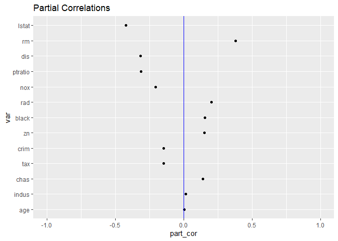
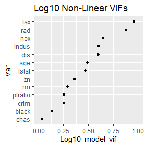
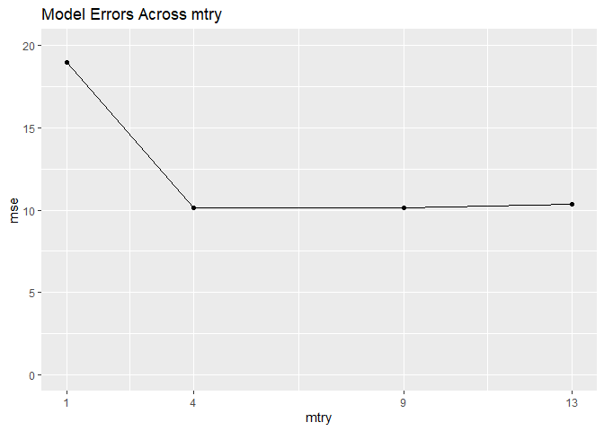
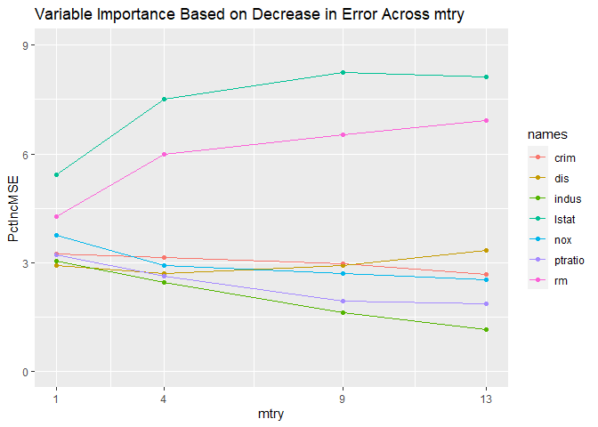
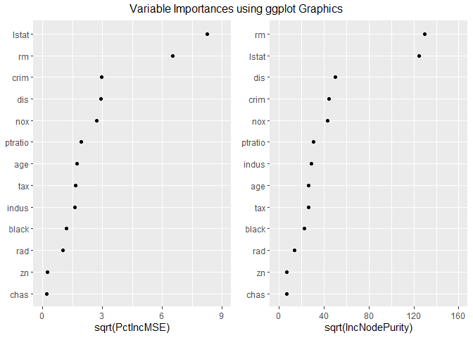

<!-- README.md is generated from README.Rmd. Please edit that file -->

# rfvip

<!-- badges: start -->

[](https://github.com/KelvynBladen/rfvip/actions/workflows/R-CMD-check.yaml)
<!-- badges: end -->

The goal of rfvip is to tune and select a good Random Forest model based
on the accuracy and variable importance metrics associated with each
model. To accomplish this, functions are available to tabulate and plot
results designed to help the user select an optimal model.

This package contains functions for assessing variable relations and
associations prior to modeling with a Random Forest algorithm (although
these are relevant for any predictive model). Metrics such as partial
correlations and variance inflation factors are tabulated as well as
plotted for the user using the functions partial_cor() and
robust_vifs().

The function mtry_compare() is available for tuning the hyper-parameter
mtry based on model performance and variable importance metrics. This
grid-search technique provides tables and plots showing the effect of
mtry on each of the assessment metrics. It also returns each of the
evaluated models to the user.

The package also provides superior ggplot2 variable importance plots for
singular models using the function ggvip(). This function is a highly
aesthetic and editable improvement upon the function
randomForest::varImpPlot() and other basic importance graphics.

All of the plots generated by these functions are developed with ggplot2
techniques so that the user has the ability to edit and improve further
upon the plots.

## Installation

You can install the released version of rfvip from
[CRAN](https://CRAN.R-project.org) with:

``` r
install.packages("rfvip")
```

You can install the development version of rfvip from
[GitHub](https://github.com/) with:

``` r
# install.packages("devtools")
devtools::install_github("KelvynBladen/rfvip")
```

You can view R package’s source code on GitHub:
<https://github.com/KelvynBladen/rfvip>

## Example

This is a basic example which shows you how to solve a common problem:

``` r
library(rfvip)
```

We will attempt to build an optimal model for the Boston housing data.
This can be found in the MASS package. To begin we will run some
preliminary diagnostics on our data.

``` r
set.seed(1234)

pcs <- partial_cor(medv ~ ., data = MASS::Boston, model = lm)
pcs$plot_y_part_cors
```



``` r

rv <- robust_vifs(medv ~ ., data = MASS::Boston, model = lm)
rv$plot_nonlin_vifs
```



These do not look too bad with regard to collinearity. The VIFs are all
less than 10. The partial correlations with the response are a type of
pseudo-importance assessing the importance each variable does not share
with the others. Now we tune our model across four mtry values.

``` r
set.seed(1)
m <- mtry_compare(medv ~ ., data = MASS::Boston, sqrt = TRUE, 
                  mvec = c(1,4,9,13), num_var = 7)
m$gg_model_errors
```



``` r
m$model_errors
#>   mtry      mse
#> 1    1 18.96051
#> 2    4 10.11247
#> 3    9 10.13187
#> 4   13 10.36482
```

According to the accuracy plot and table, our best choice is when mtry
is 4. However, the accuracy for the best model is very similar to two of
the other models. We now look at the variable importance metrics across
the different models.

``` r
m$gg_var_imp_error
```



The top two variables are consistent. However, the variables ‘nox’ and
‘dis’ switch order as mtry increases. Common sense suggests that
pollution(nox) is correlated with distance to employment centres(dis).
It can be assumed that most home buyers consider location to work more
than pollution when selecting a house. Therefore, ‘dis’ is likely a more
casual driving of price than ‘nox’. Consequently, the model where mtry
is 9 appears to be superior to the model where mtry is 4 (even if it is
slightly more accurate).

We now take our selected model and build individual importance plots for
it.

``` r
g <- ggvip(m$rf9)$both_vips
```



Looks great. We have used variable importance and accuracy metrics to
pick a solid model for prediction and with reasonably useful importance
values.
